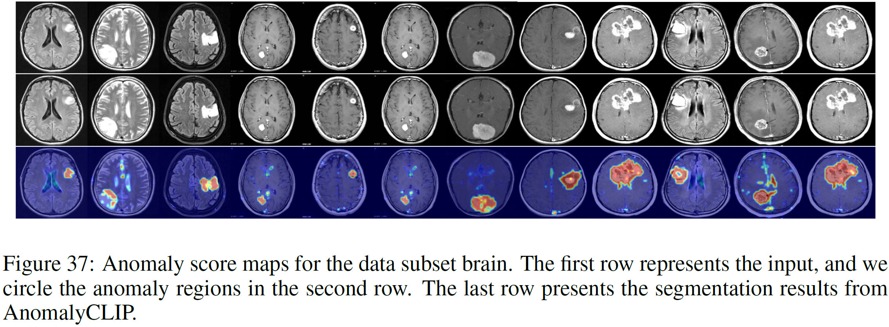

# FairSeg 
> [**ICLR 24**] [**AnomalyCLIP: Object-agnostic Prompt Learning for Zero-shot Anomaly Detection**](https://arxiv.org/pdf/2310.18961.pdf)
>
> by [Qihang Zhou*](https://shiminxst.github.io/index.html), [Guansong Pang*](https://www.guansongpang.com/),  [Yu Tian](https://yutianyt.com/), Shibo He, Jiming Chen.


## Updates

- **03.19.2024**: Open source !!!

## Introduction 
Zero-shot anomaly detection (ZSAD) requires detection models trained using auxiliary data to detect anomalies without any training sample in a target dataset. It is a crucial task when training data is not accessible due to various concerns, e.g., data privacy, yet it is challenging since the models need to generalize to anomalies across different domains where the appearance of foreground objects, abnormal regions, and background features, such as defects/tumors on different products/organs, can vary significantly. Recently large pre-trained vision-language models (VLMs), such as CLIP,
have demonstrated strong zero-shot recognition ability in various vision tasks, including anomaly detection. However, their ZSAD performance is weak since the VLMs focus more on modeling the class semantics of the foreground objects rather than the abnormality/normality in the images.
In this paper we introduce a novel approach, namely AnomalyCLIP, to adapt CLIP for accurate ZSAD across different domains. The key insight of AnomalyCLIP is to learn object-agnostic text prompts that capture generic normality and abnormality in an image regardless of its foreground objects. This allows our model to focus on the abnormal image regions rather than the object semantics, enabling generalized normality and abnormality recognition on diverse types of objects. Large-scale experiments on 17 real-world anomaly detection datasets show that AnomalyCLIP achieves superior zero-shot performance of detecting and segmenting anomalies in datasets of highly diverse class semantics from various defect inspection and medical imaging domains. All experiments are conducted in PyTorch-2.0.0 with a single NVIDIA RTX 3090 24GB. 

## Overview of AnomalyCLIP


## Analysis of different text prompt templates
 

## Main results

### Industrial dataset
 


### Medical dataset
 


## Visualization

 

 

 

 

## How to Run
### Prepare your dataset
Download the dataset below:

* Industrial Domain:
[MVTec](https://www.mvtec.com/company/research/datasets/mvtec-ad), [VisA](https://github.com/amazon-science/spot-diff), [MPDD](https://github.com/stepanje/MPDD), [BTAD](http://avires.dimi.uniud.it/papers/btad/btad.zip), [SDD](https://www.vicos.si/resources/kolektorsdd/), [DAGM](https://www.kaggle.com/datasets/mhskjelvareid/dagm-2007-competition-dataset-optical-inspection), [DTD-Synthetic](https://drive.google.com/drive/folders/10OyPzvI3H6llCZBxKxFlKWt1Pw1tkMK1)

* Medical Domain:
[HeadCT](https://www.kaggle.com/datasets/felipekitamura/head-ct-hemorrhage), [BrainMRI](https://www.kaggle.com/datasets/navoneel/brain-mri-images-for-brain-tumor-detection), [Br35H](https://www.kaggle.com/datasets/ahmedhamada0/brain-tumor-detection), [COVID-19](https://www.kaggle.com/datasets/tawsifurrahman/covid19-radiography-database), [ISIC](https://isic-challenge-data.s3.amazonaws.com/2016/ISBI2016_ISIC_Part1_Test_Data.zip), [CVC-ColonDB](https://figshare.com/articles/figure/Polyp_DataSet_zip/21221579), [CVC-ClinicDB](https://figshare.com/articles/figure/Polyp_DataSet_zip/21221579), [Kvasir](https://figshare.com/articles/figure/Polyp_DataSet_zip/21221579), [Endo](https://drive.google.com/file/d/1LNpLkv5ZlEUzr_RPN5rdOHaqk0SkZa3m/view), [TN3K](https://github.com/haifangong/TRFE-Net-for-thyroid-nodule-segmentation?tab=readme-ov-file).

### Generate the dataset JSON
```bash
cd generate_dataset_json
python mvtec.py
```
Select the corresponding script and run it (we provide all scripts for datasets that AnomalyCLIP reported). The generated JSON stores all the information that AnomalyCLIP needs.

### Run AnomalyCLIP
* Quick start (use the pre-trained weights)
```bash
bash test.sh
```
  
* Train your own weights
```bash
bash train.sh
```


## We provide the reproduction of WinCLIP [here](https://github.com/zqhang/WinCLIP-pytorch)


* We thank for the code repository: [open_clip](https://github.com/mlfoundations/open_clip), [DualCoOp](https://github.com/sunxm2357/DualCoOp), [CLIP_Surgery](https://github.com/xmed-lab/CLIP_Surgery), and [VAND](https://github.com/ByChelsea/VAND-APRIL-GAN/tree/master).
## BibTex Citation

If you find this paper and repository useful, please cite our paper.

```
@article{zhou2024anomalyclip,
  title={AnomalyCLIP: Object-agnostic Prompt Learning for Zero-shot Anomaly Detection},
  author={Zhou, Qihang and Pang, Guansong and Tian, Yu and He, Shibo and Chen, Jiming},
  journal={The Twelfth International Conference on Learning Representations},
  year={2024}
}
```
